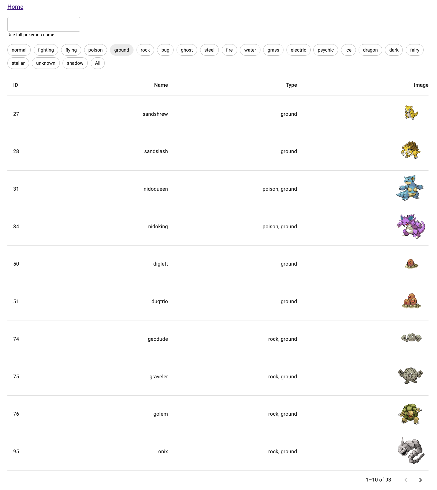
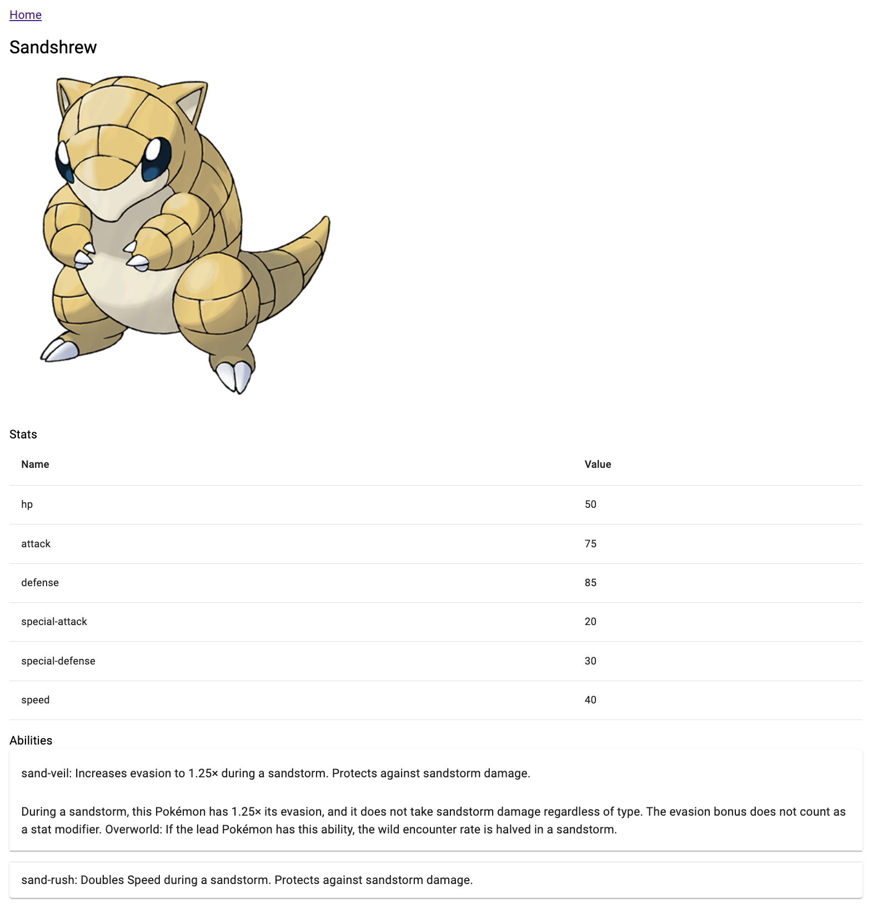

# Technical assignment for GRASP Innovations

## Assignment:

The goal is to display a list of Pokémons with features such as filtering by type and searching by name. It is also possible to view detailed information about a Pokémon.

## Demo (screenshots)

  
Home page

  
  

  
Details page

  
  

## Architecture

In this application, I adopted the Feature-Sliced Design (FSD) architecture, which emphasizes a feature-centric, modular approach. The primary goal of this architecture is to ensure that features are self-contained, cohesive, and independent. This promotes scalability and maintainability as the project grows. This approach ensures that the application can handle increasing complexity while maintaining a clean, organized structure, which is critical for long-term development in a multi-developer environment.

## Available Scripts

In the project directory, you can run:

### `yarn install`

Installs dependencies.

### `yarn dev`

Runs the app in the development mode.\
Open [http://localhost:5173/](http://localhost:5173/) to view it in the browser.
